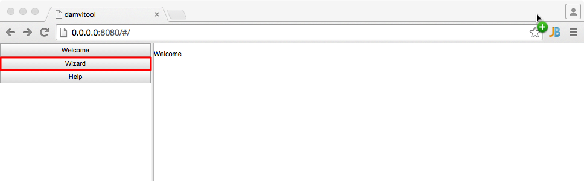
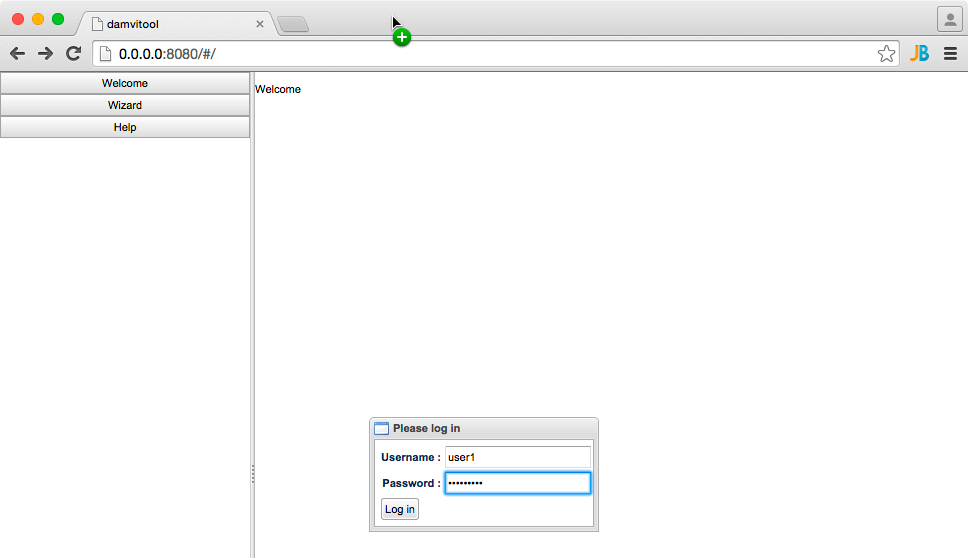
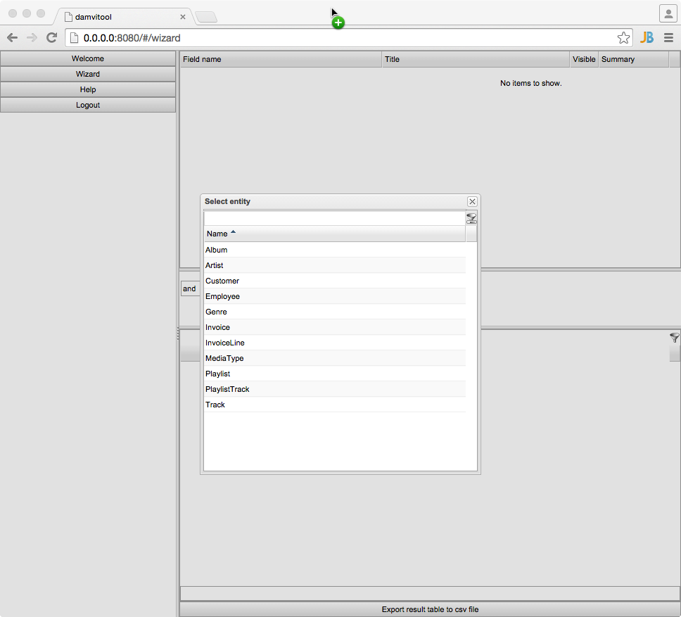
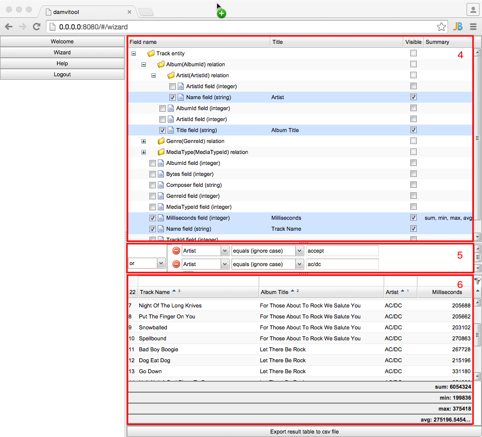

========================
damvitool frontend usage
========================

Open frontend
-------------
Open damvitool frontend in your browser. By default you can open url ``http://localhost:8080``

Construct new request to database
---------------------------------
1. Click ``Wizard`` button of the left side menu

2. Login.

3. Choose root entity of yours data query. If database don't have relations between tables, you can add other root entities.

4. Choose entities fields, which you want to see.
5. Set filter criteria.
6. View results.

